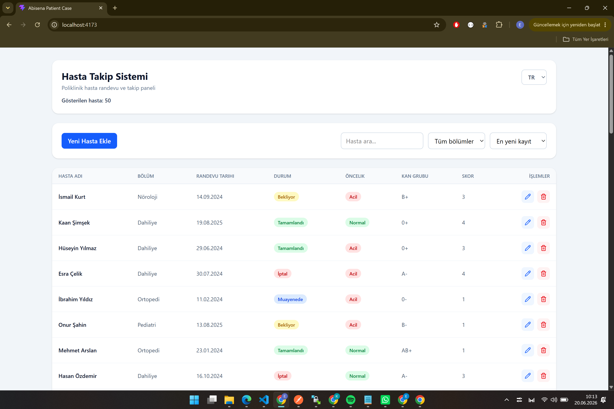
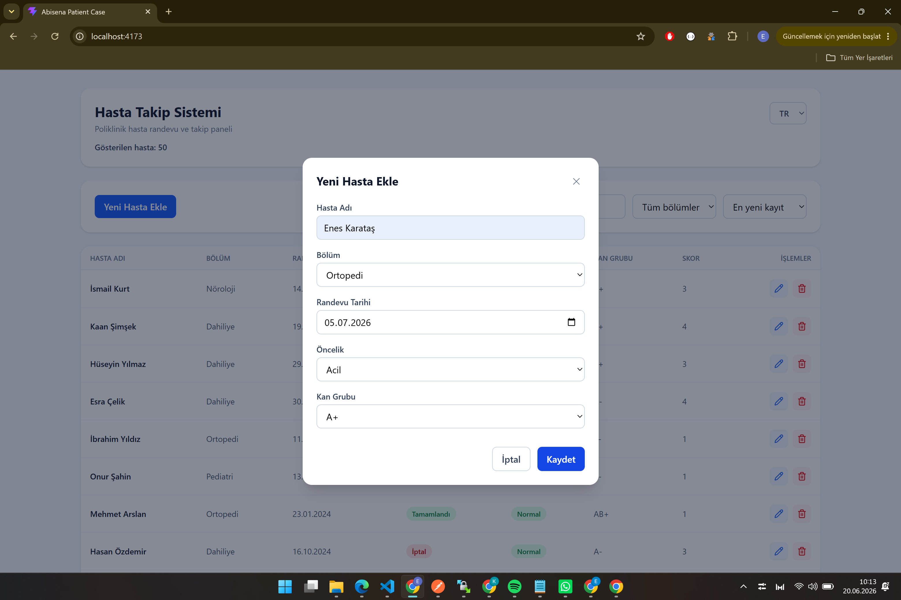
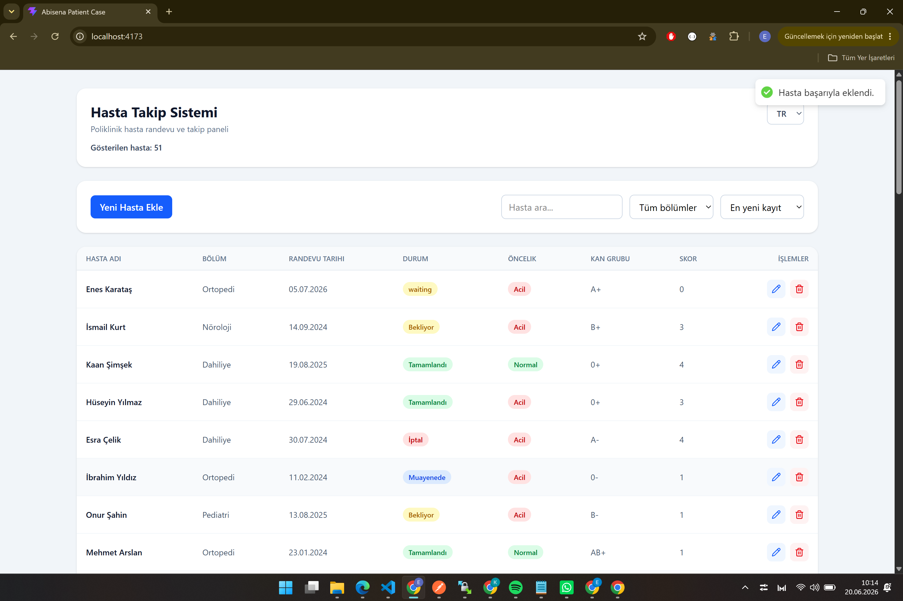
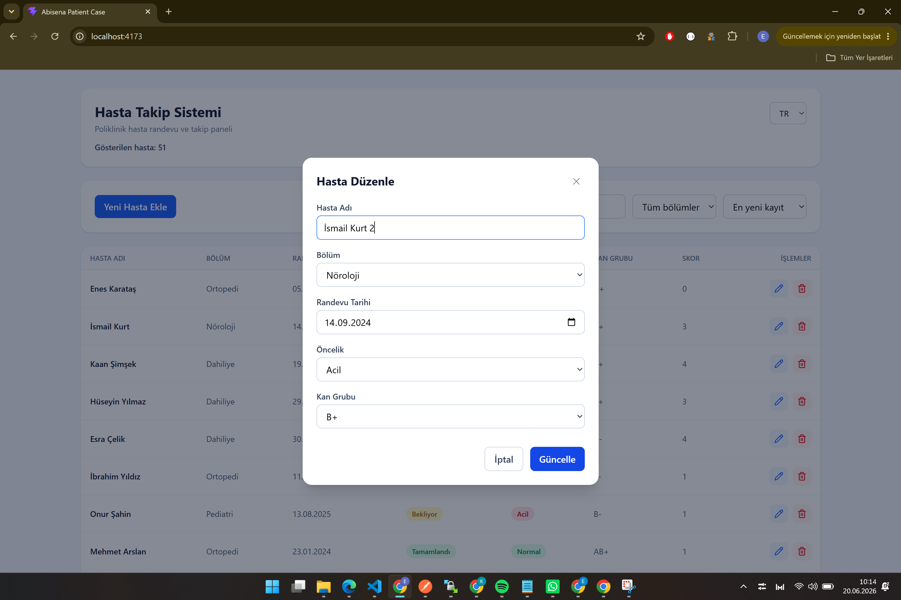
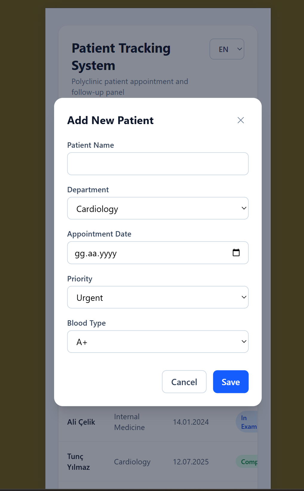
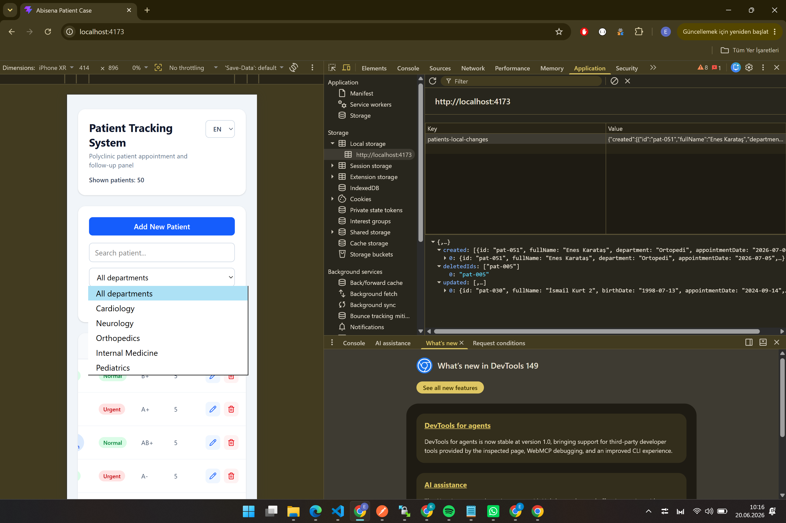

# Patient Tracking System



A patient management application built with React 18 and TypeScript.

## Tech Stack

* React 18
* TypeScript
* Vite
* Tailwind CSS
* React Hook Form
* Zod
* i18next
* Axios

## Features

* Fetch patient records from API
* Create patient records locally
* Update patient records locally
* Delete patient records locally
* Search patients
* Local persistence with localStorage
* Filter by department
* Sort patient records
* Turkish / English language support
* Form validation with React Hook Form and Zod
* Responsive dashboard UI

## Installation

```bash
npm install
```

## Development

```bash
npm run dev
```

## Production Build

```bash
npm run build
```

## API Endpoint

```txt
https://v0-json-api-three.vercel.app/api/data
```

## Project Structure

```txt
src/
├── app/
├── features/
│   └── patients/
│       ├── components/
│       ├── constants/
│       ├── hooks/
│       ├── schemas/
│       ├── services/
│       ├── types/
│       └── utils/
├── i18n/
├── shared/
└── styles/
```

## Architecture Notes

* Patient data is initially fetched from the provided API endpoint.
* Create, update, and delete operations are managed locally using React state.
* Business logic is separated into custom hooks and utility functions.
* Internationalization is implemented using i18next.
* Form validation is implemented using React Hook Form and Zod.
* The UI is styled with Tailwind CSS.

## Implemented Requirements

* React 18
* TypeScript
* API Data Fetching (GET)
* Local Create Operation
* Local Update Operation
* Local Delete Operation
* Search Functionality
* Filtering Functionality
* Sorting Functionality
* Turkish / English Support

## Screenshots












